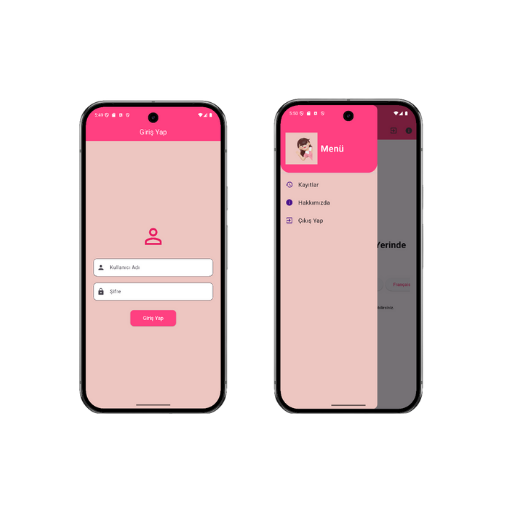

# Mobil Uygulama Geliştirme Projesi

## Projedeki Sayfaların Görevleri ve İçerikleri

### 1. **Splash Screen (Başlangıç Ekranı)**
- **Görevi**: Uygulama açıldığında ilk görünen ekrandır. Genellikle uygulamanın logosu ve bir animasyon gösterilir. Kullanıcıyı karşılamak için kısa bir süre görünür.
- **İçeriği**: Uygulama açılır açılmaz animasyonlu bir şekilde kullanıcıyı selamlayan bir ekran.

### 2. **Greeting Screen (Selamlaşma Ekranı)**
- **Görevi**: Kullanıcıya hoş geldin mesajı sunar ve farklı dillerde selamlaşmalar izlemelerini sağlar.
- **İçeriği**: "Haydi Dünyanın Her Yerinde Selamlaşalım!" yazısı ile kullanıcıya dil seçimini yapabileceği butonlar sunulur. Kullanıcı bir dile tıkladığında ilgili dilde selamlaşma mesajı ve animasyon gösterilir.

### 3. **About Page (Hakkımızda Sayfası)**
- **Görevi**: Uygulamanın amacı, işlevi ve geliştiricileri hakkında bilgi verir.
- **İçeriği**: Uygulamanın özellikleri, geliştirilme süreci, kullanılan teknolojiler ve grup üyelerinin bilgileri yer alır.

### 4. **Language Button (Dil Seçim Butonu)**
- **Görevi**: Kullanıcıların çeşitli dillerde animasyonlar izlemesine olanak sağlar.
- **İçeriği**: Dil seçimi butonları. Türkçe, İngilizce, Almanca, İspanyolca, Fransızca gibi dillerde animasyonlu selamlaşmalar sunar.

### 5. **Drawer (Menü)**
- **Görevi**: Kullanıcılara uygulamanın farklı sayfalarına hızlı erişim sağlar. Menüde "Kayıtlar" ve "Çıkış Yap" gibi seçenekler bulunur.
- **İçeriği**: Kullanıcıların uygulama içinde gezintilerini kolaylaştıran, başta ana sayfa ve kayıtlar olmak üzere, yönlendiren menü öğeleri içerir.

### 6. **Records Page (Kayıtlar Sayfası)**
- **Görevi**: Kullanıcıların önceki etkinliklerini veya verilerini görüntülemesine olanak tanır.
- **İçeriği**: Kullanıcıya geçmiş kayıtlar ve yapılan işlemler sunulur.

### 7. **Animated Greeting (Animasyonlu Selamlaşma)**
- **Görevi**: Kullanıcıların seçtiği dile göre animasyonlu bir şekilde selamlaşma mesajı gösterir.
- **İçeriği**: `language` ve `animationType` parametreleri ile dil bazında selamlaşma mesajını gösteren animasyonu render eder. Bu animasyon, kullanıcı dil seçimini yaptıktan sonra ekranda belirir ve 2 saniye süresince görünür hale gelir.

### 8. **Main Page (Ana Sayfa)**
- **Görevi**: Kullanıcılara dil seçimi yapma ve selamlaşma animasyonlarını izleme olanağı sağlar.
- **İçeriği**: Hoş geldiniz mesajı, dil seçimi butonları ve diğer temel sayfalar. Ana sayfa, kullanıcıya dil seçme ve animasyonları izleme deneyimi sunar.

### 9. **Login Screen (Giriş Ekranı)**
- **Görevi**: Kullanıcıların sisteme giriş yapmalarını sağlar.
- **İçeriği**: Kullanıcı adı ve şifre girişi yapılır, ardından başarılı bir giriş ile kullanıcıya ana sayfaya yönlendirilir.

## Login Bilgileri Nasıl Saklandı

- **SharedPreferences**: Kullanıcı bilgilerini cihazda saklamak için kullanılmıştır.

## Drawer menüde kullandığımız logoya ait api bilgileri
- **API (URL):**
- https://img.freepik.com/free-vector/3d-businesswoman-work-with-job-character_40876-3733.jpg?t=st=1744052450~exp=1744056050~hmac=4af7e91bd5490fb03538fdf32d460932b88d22b2b48554eec6aa44f576aa717e&w=740
- **Sağlayıcı:**
- Freepik (https://www.freepik.com)

## Grup Üyelerinin Projeye Katkısı
-- Aleyna Özmen ve Merve Özer, eşit iş yükü ile aynı görevleri üstelenerek projeye katkı sağlamıştır.

## Anlatmak İstediğimiz Diğer Bilgiler;

## Uygulamanın Kullanımı

1. **Giriş Yapın**: Uygulama ilk açıldığında, kullanıcı adı ve şifre bilgilerini girerek sisteme giriş yapabilirsiniz.
2. **Dil Seçimi**: Ana sayfada yer alan dil seçim butonlarına tıklayarak dilediğiniz dilde selamlaşma animasyonlarını izleyebilirsiniz. Dil seçeneklerini görmek için kaydırma yapmanız gerekebilir.
3. **Kayıtlar Sayfası**: Geçmiş etkinliklerinizi görmek ve daha fazla bilgi almak için "Kayıtlar" sekmesini kullanabilirsiniz.
4. **Hakkımızda Sayfası**: Uygulamanın özelliklerini ve geliştirilme sürecini görmek için "Hakkımızda" sekmesine tıklayabilirsiniz.
5. **Çıkış Yapın**: Uygulamada yaptığınız işlemleri tamamladıktan sonra çıkış yapmak için "Log out" butonuna tıklayarak güvenli bir şekilde çıkış yapabilirsiniz.

Bu proje, kullanıcı dostu bir dil seçim ve selamlaşma uygulaması olarak tasarlanmıştır. Kullanıcıların kolayca farklı dillerde selamlaşmalarını sağlayan animasyonlu butonlar ve kullanıcı dostu bir arayüz sunmaktadır. Ayrıca, login işlemleri ve kayıt sayfaları ile uygulamanın temel işlevleri başarılı bir şekilde yerine getirilmiştir. Proje, modern uygulama geliştirme tekniklerini kullanarak Flutter ile oluşturulmuştur.

## Teknolojiler

- **Flutter**: Uygulamanın tüm arayüzü ve işlevselliği için kullanılmıştır.
- **Flutter Launcher Icons**: Uygulama simgelerinin farklı platformlarda düzgün şekilde görünmesi için kullanılmıştır.
- **Lottie Animations**: Animasyonlu dil seçimi ve selamlaşma mesajları için kullanılmıştır.

## Uygulama Görselleri

